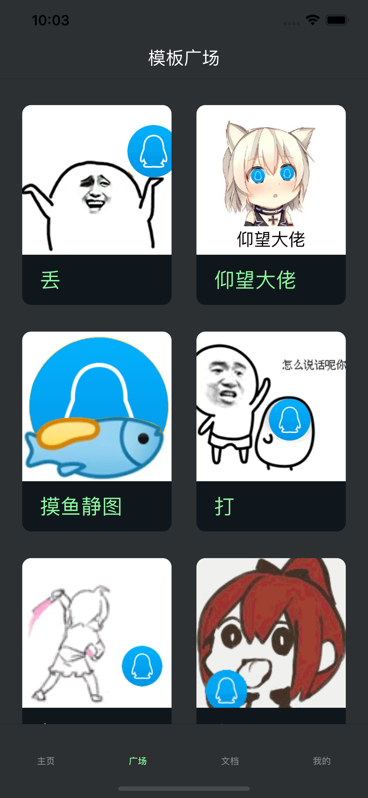
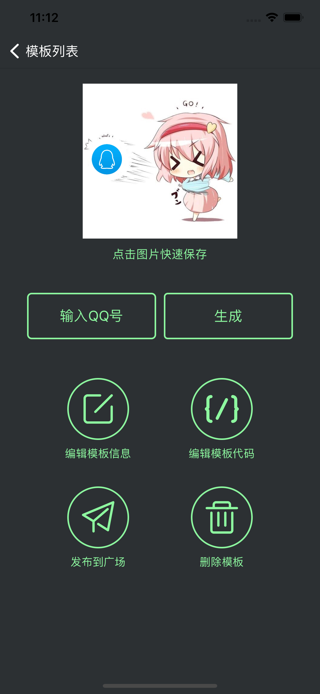
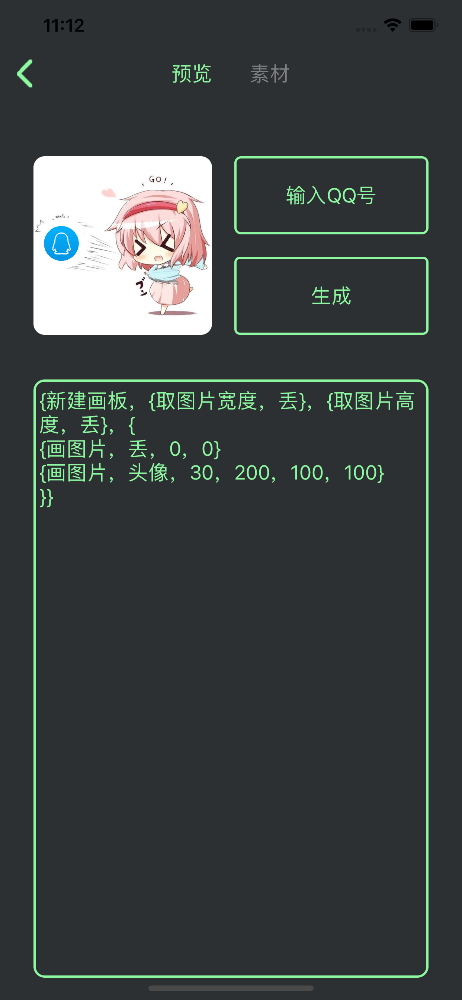
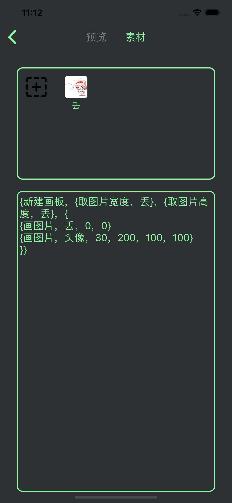

# StickerCustom

## 简介

```
一个支持生成与QQ头像有关的有趣表情包的App。

在模板的基础上，你只需输入一个QQ号，即可使用此QQ的头像来制作一个有趣的表情包。

你可以使用约定的特殊语言格式写出代码来制作自定义的模板，也可以下载其他用户上传的模板使用。
```







## 依赖

```
pod 'SnapKit', '~> 5.0.0'
pod 'Alamofire', '~> 5.5'
pod 'SSZipArchive'
```
